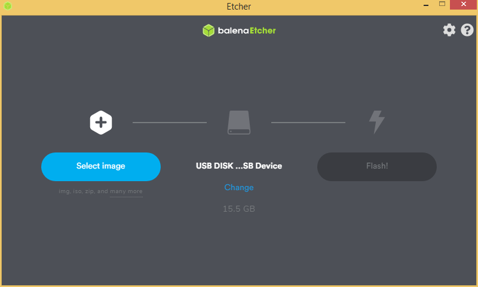
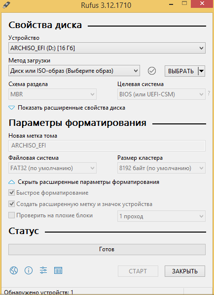
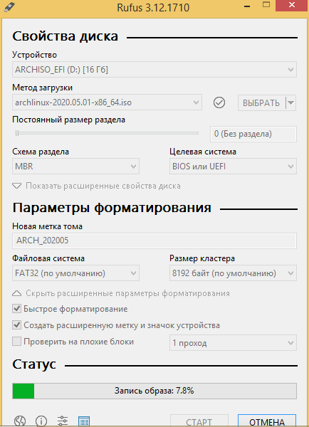

# Установка и настройка системы

И так, вы выбрали дистрибутив. Приступим к установке!


### Для установки нам потребуется:

- Рабочий компьютер
- USB флэшка
- Интернет соединение


### Скачиваем дистрибутив

Тут все просто, думаю не стоит объяснять. Просто заходите на сайт выбранного дистрибутива, и скачиваете последнюю версию. Обычно скачивание прямое, но иногда можно скачать через торрент, от себя советую этот способ, т. к. таким способом скачается быстрее. 

> Ссылки на сайты основных дистрибутивов находятся в предыдущем параграфе

Скачали? Тогда переходим к следующему шагу!


### Записываем установщик на флэшку

Рассматривать метод с CD/DVD-ROM не буду, так как кто этой древностью сейчас пользуется?

Уточню, что рассматриваться будут способы записи на Windows, так как предполагается, что вы собираетесь поставить Linux второй системой/перейти на него для сборки прошивок и других полезных дел.

Так, нам нужна утилита для записи. Подойдет Etcher или тот же Rufus, без разницы. Рассмотрим подробнее...


### Вариант с Etcher

Скачиваем утилиту с сайта https://www.balena.io/etcher/. Вставляем ненужную флэшку в компьютер. Ну или нужную, просто предварительно скопируйте все нужные вам данные с нее. Запускаем Etcher

<p align="center">
  
</p>

Откроется данное окно. Как видно, тут все предельно просто:

    1. Выбираем образ дистрибутива
    2. Выбираем USB устройство
    3. Нажимаем Flash

<p align="center">
  
  
  
</p>


Все, загрузочная флэшка записана

### Вариант с Rufus

Тут все немного по-сложнее чем с Etcher, но тоже просто.

Скачиваем утилиту с сайта https://rufus.ie/. Запускаем...

<p align="center">
  
</p>

Откроется данное окно.

1. Выбираем устройство

2. Выбираем образ дистрибутива

3. В случае с Linux образами без разницы какой тип разделов на флешке выбирать, это имеет вес для Windows образов. Так же не имеет веса настройки файловой системы.
    Вот как примерно выглядит окно после настройки
    <p align="center">
      
    </p>
    Интересная фишка. Можно создать так называемый persist раздел прямо в утилите без заморочек. Он нужен для сохранения данных/настроек на LiveUSB

4. Нажимаем Старт

   **Важно!** Вас спросят о способе записи образа, так как почти все образы с Linux являются ISO-Hybrid образами. Не буду вдаваться в подробности, скажу только что нужно **обязательно выбрать "Запись в режиме DD-образ"**
   <p align="center">
      
   </p>
   
5. Соглашаемся с этим
   <p align="center">
      
   </p>

6. Остается только ждать...
   <p align="center">
      
   </p>
   

После того, как мы записали флэшку, самое время установить систему!

## Установка системы

К сожалению, раскрыть данный этап подробно я не могу ввиду технических возможностей. Но в интернете очень много гайдов, и ставить ту же Ubuntu не сложнее чем Windows. Установка [Arch](https://wiki.archlinux.org/title/Installation_guide) ([GUI](https://archlinuxgui.in/tutorials.html))| [Ubuntu](https://help.ubuntu.ru/wiki/ubuntu_install)

> Я буду очень надеяться, что мои "коллеги" дополнят этот раздел подробной инструкцией

### Настройка среды

### Установка необходимых пакетов

- **Debian-like:**
	```bash
	sudo apt-get install git-core gnupg flex bison build-essential zip curl zlib1g-dev gcc-multilib g++-multilib libc6-dev-i386 libncurses5 lib32ncurses5-dev x11proto-core-dev libx11-dev lib32z1-dev libgl1-mesa-dev libxml2-utils xsltproc unzip fontconfig repo python
	```
	
- **Arch-like:**
 *Через [AUR](https://github.com/Jguer/yay#installation)*

   ```bash
   yay -S lineageos-devel python
   ```

### Настройка git
Вписываем свой никнейм и почту на GitHub:

```bash
git config --global user.name "Your Name"
git config --global user.email "you@example.com"
```
