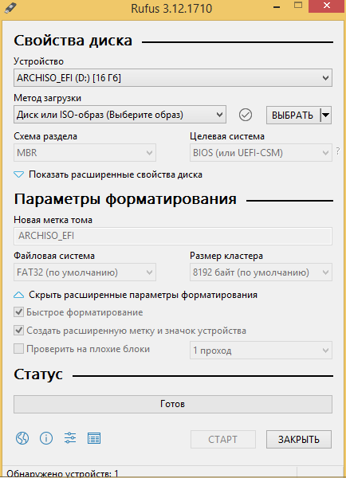
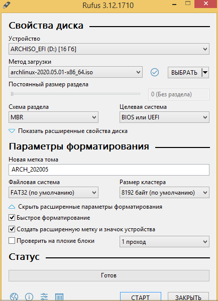
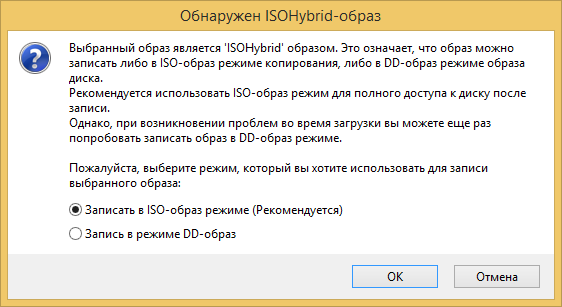
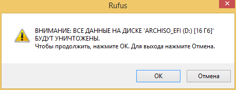
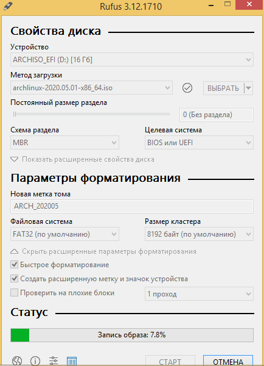

# Параграф 2: Установка и настройка системы

И так, вы выбрали дистрибутив. Приступим к установке!


### Для установки нам потребуется:

- Рабочий компьютер
- USB флэшка
- Интернет соединение


### Скачиваем дистрибутив

Тут все просто, думаю не стоит объяснять. Просто заходите на сайт выбранного дистрибутива, и скачиваете последнюю версию. Обычно скачивание прямое, но иногда можно скачать через торрент, от себя советую этот способ, т. к. таким способом скачается быстрее. 

> Ссылки на сайты основных дистрибутивов находятся в предыдущем параграфе

Скачали? Тогда переходим к следующему шагу!


### Записываем установщик на флэшку

Рассматривать метод с CD/DVD-ROM не буду, так как кто этой древностью сейчас пользуется?

Уточню, что рассматриваться будут способы записи на Windows, так как предполагается, что вы собираетесь поставить Linux второй системой/перейти на него для сборки прошивок и других полезных дел.

Так, нам нужна утилита для записи. Подойдет Etcher или тот же Rufus, без разницы. Рассмотрим подробнее...

1. [Etcher](#вариант-с-etcher)
2. [Rufus](#вариант-с-rufus)
3. [Ventoy](#вариант-с-ventoy)

### Вариант с Etcher

Скачиваем утилиту с сайта https://www.balena.io/etcher/. Вставляем ненужную флэшку в компьютер. Ну или нужную, просто предварительно скопируйте все нужные вам данные с нее. Запускаем Etcher

<p align="center">
  
</p>

Откроется данное окно. Как видно, тут все предельно просто:

    1. Выбираем образ дистрибутива
    2. Выбираем USB устройство
    3. Нажимаем Flash

<p align="center">
  
  
  
</p>


Все, загрузочная флэшка записана

### Вариант с Rufus

Тут все немного по-сложнее чем с Etcher, но тоже просто.

Скачиваем утилиту с сайта https://rufus.ie/. Запускаем...

<p align="center">
  
</p>

Откроется данное окно.

1. Выбираем устройство

2. Выбираем образ дистрибутива

3. В случае с Linux образами без разницы какой тип разделов на флешке выбирать, это имеет вес для Windows образов. Так же не имеет веса настройки файловой системы.
    Вот как примерно выглядит окно после настройки
    <p align="center">
      
    </p>
    Интересная фишка. Можно создать так называемый persist раздел прямо в утилите без заморочек. Он нужен для сохранения данных/настроек на LiveUSB

4. Нажимаем Старт

   **Важно!** Вас спросят о способе записи образа, так как почти все образы с Linux являются ISO-Hybrid образами. Не буду вдаваться в подробности, скажу только что нужно **обязательно выбрать "Запись в режиме DD-образ"**
   <p align="center">
      
   </p>
   
5. Соглашаемся с этим
   <p align="center">
      
   </p>

6. Остается только ждать...
   <p align="center">
      
   </p>

### Вариант с Ventoy

Ventoy - это инструмент с открытым исходным кодом для создания загрузочного USB-накопителя для файлов ISO/WIM/IMG/VHD(x)/EFI.
С Ventoy не нужно форматировать диск снова и снова, достаточно скопировать файлы образов на USB-накопитель и загрузить его. Можно скопировать много файлов образов одновременно, и ventoy предложит меню загрузки для их выбора.
<p align="center">
  
  Скриншот Ventoy с меню выбора ОС
</p>

Именно эта утилита является самой продвинутой среди двух ранее рассмотренных вариантов. Как было понятно с описания - вам следует всего лишь перекинуть .iso образ диска на флешку и все. Никакого форматирования вашего 1ТБ диска, чтобы записать жалкие ~5гб образа, не прекрасно ли? Прекрасно.

**Приступаем к установке!**

1. Заходим на GitHub проекта, в [Releases](https://github.com/ventoy/Ventoy/releases/) качаем последнюю сборку
2. Распаковываем, запускаем
3. Получаем на выходе простой интерфейс, где мы выбираем диск, на который будет установлен Ventoy
> **ВАЖНО!** Все данные с диска будут удалены/отформатированы. Не забудьте забэкапить влажные файлы

4. Жмем кнопку Install... Profit
5. В результате у нас появится раздел с названием Ventoy, на который можно простым движением переместить образ системы.
6. Грузимся с этой флешки. 

После того, как мы записали флэшку, самое время установить систему!

## Установка системы

К сожалению, раскрыть данный этап подробно я не могу ввиду технических возможностей. Но в интернете очень много гайдов, и ставить ту же Ubuntu не сложнее чем Windows. Установка [Arch](https://wiki.archlinux.org/title/Installation_guide) ([GUI](https://archlinuxgui.in/tutorials.html))| [Ubuntu](https://help.ubuntu.ru/wiki/ubuntu_install)

> Я буду очень надеяться, что мои "коллеги" дополнят этот раздел подробной инструкцией

### Настройка среды

### Установка необходимых пакетов

- **Debian-like:**
	```bash
	sudo apt-get install bc bison build-essential ccache curl flex g++-multilib gcc-multilib git git-lfs gnupg gperf imagemagick lib32ncurses5-dev lib32readline-dev lib32z1-dev libelf-dev liblz4-tool libncurses5 libncurses5-dev libsdl1.2-dev libssl-dev libxml2 libxml2-utils lzop pngcrush rsync schedtool squashfs-tools xsltproc zip zlib1g-dev repo
	```
	
- **Arch-like:**
 *Через [AUR](https://github.com/Jguer/yay#installation)*

   ```bash
   yay -S lineageos-devel python
   ```

### Настройка git
Вписываем свой никнейм и почту на GitHub:

```bash
git config --global user.name "Your Name"
git config --global user.email "you@example.com"
```

Включаем поддержку lfs:

```bash
git lfs install
```

