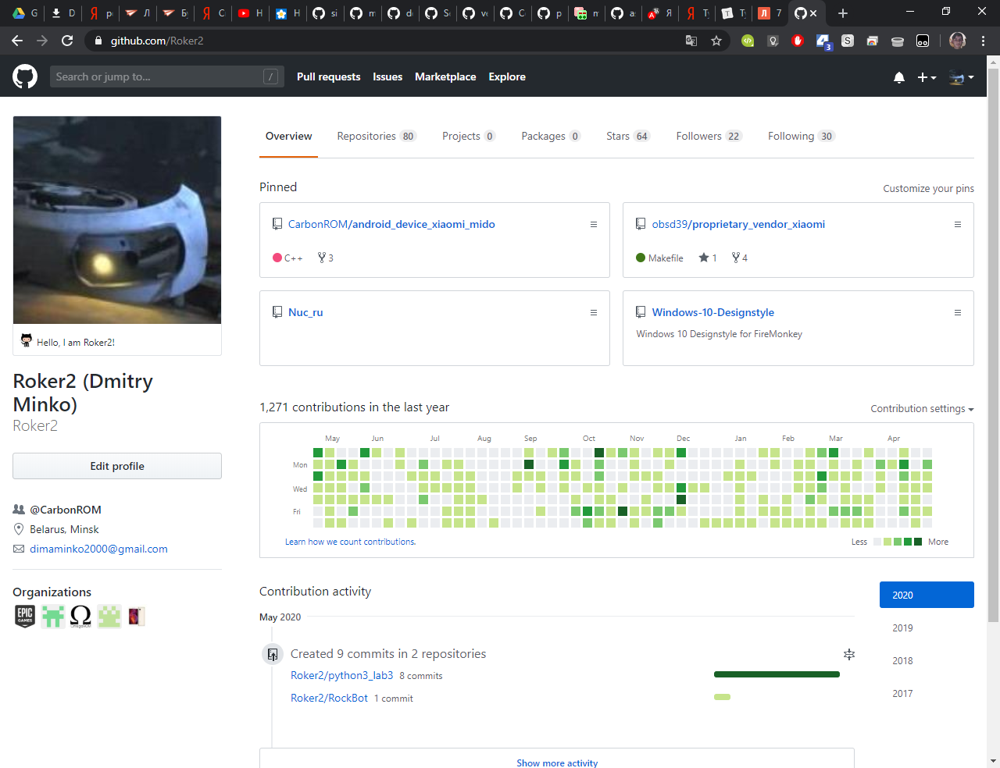

# Параграф 1: Создание аккаунта на GitHub и настройка git под свой аккаунт

Хочу сказать, что если Вы имеете аккаунт на GitHub или чем-то подобном и знаете git, то это глава Вам не нужна, ибо Вы и так все знаете.

## Создаем аккаунт на GitHub

Тут в принципе ничего сложного, просто идем на [github.com](https://github.com/), вводим почту и пароль, входим, вуаля, у нас есть аккаунт на GitHub. Здесь мы можем создавать свои репозитории, в том числе и приватные, оценить чей-то репозиторий, подписаться на обновления репозитория, подписаться на человека, искать какие-то репозитории, поставить аватарку и статус :)

<p align="center">
  
</p>

Перейдем к тому, чтобы наши коммиты (commits) и черри-пики (cherry-picks) имели информацию о нас.

И так, варианта два и они различаются лишь флагом `--global`, который говорит, что информация о нас будет использоваться везде по умолчанию.

Пример глобальной настройки пользователя

```bash
git config --global user.name "John Doe"
git config --global user.email johndoe@example.com
```

[Оригинал](https://git-scm.com/book/ru/v2/%D0%92%D0%B2%D0%B5%D0%B4%D0%B5%D0%BD%D0%B8%D0%B5-%D0%9F%D0%B5%D1%80%D0%B2%D0%BE%D0%BD%D0%B0%D1%87%D0%B0%D0%BB%D1%8C%D0%BD%D0%B0%D1%8F-%D0%BD%D0%B0%D1%81%D1%82%D1%80%D0%BE%D0%B9%D0%BA%D0%B0-Git), откуда был взят пример

`John Doe` это никнейм вашего GitHub аккаунта, а `johndoe@example.com` - почта, которую Вы использовали при регистрации на GitHub.
